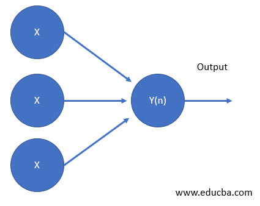
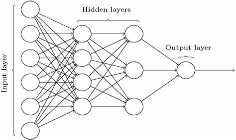

<h1 align="center">Simple NN</h1>
 
Simple NN is a training example on how to write a neural network from scratch.

In this example we will use a simple neural network to classify handwritten digits.

To lear more about Neural networks and how they work, check out the following resources:

A simple single layer neural network:  

A simple multi layered neural network:  

A nice YouTube video on how neural networks work:  
https://www.youtube.com/watch?v=aircAruvnKk   This video is a great introduction to neural networks and how they work and a must watch for beginners.

I highly recommend the book "Make your own neural network" by Tariq Rashid. It's a great book for beginners and it's very easy to understand.

The power point presentation is available in the repository. 
Introduction To Neural Networks and AI.pptx